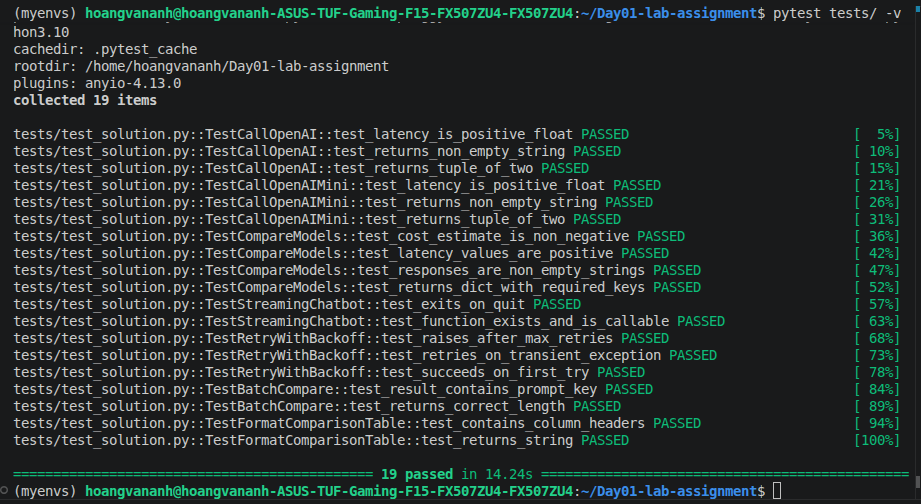

# Báo cáo kiểm thử

## Tổng quan
- Tên: `Hoàng Văn Anh`
- Mã học viên: `2A202600762`
- Dự án: `Day01-lab-assignment`
- File chính: `template.py`
- Thư mục kiểm thử: `tests/`
- Môi trường Python: `myenvs`

## Kết quả kiểm thử
- Lệnh chạy: `pytest tests/ -v`
- Kết quả: tất cả tests đã pass
- Số tests: 19

## Nội dung đã kiểm tra
- `call_openai` trả về tuple `(response_text, latency)` và độ trễ là số dương
- `call_openai_mini` trả về kết quả và latency hợp lệ
- `compare_models` trả về dict chứa các khóa:
  - `gpt4o_response`
  - `mini_response`
  - `gpt4o_latency`
  - `mini_latency`
  - `gpt4o_cost_estimate`
- `streaming_chatbot` tồn tại và có thể gọi được
- `retry_with_backoff` thực hiện retry đúng và ném lỗi khi vượt quá số lần retry
- `batch_compare` trả về danh sách với đúng số phần tử và chứa key `prompt`
- `format_comparison_table` trả về chuỗi định dạng bảng có tiêu đề cột phù hợp

## Chạy thử chatbot
You: bạn cảm thấy Việt Nam hôm nay thế nào?
Assistant: Tôi không có cảm xúc hay cảm giác như con người, nhưng tôi có thể cung cấp thông tin. Nếu bạn quan tâm đến tình hình hiện tại ở Việt Nam, bạn có thể xem các nguồn tin tức địa phương hoặc quốc tế để cập nhật thông tin mới nhất về kinh tế, chính trị, văn hóa hay các sự kiện xã hội đang diễn ra. Bạn có muốn biết thêm về lĩnh vực cụ thể nào tại Việt Nam không?

